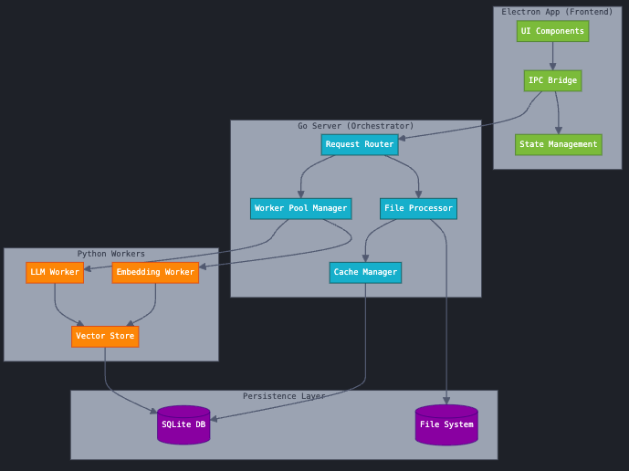

# Kita

A modern take on the Mac Spotlight.

Fast and intelligent search running locally on your mac.

(Kita means "found" in Japanese)

# Architecture

## Components

1. Electron Frontend Layer

   - UI Components: User interface elements
   - IPC Bridge: Handles communication between frontend and backend
   - State Management: Manages application state and UI updates

2. Go Orchestrator Layer

   - Request Router: Handles incoming requests from the frontend
   - File Processor: Handles file operations and indexing
   - Cache Manager: Manages in-memory caching for performance
   - Worker Pool Manager: Coordinates Python workers

3. Python Workers Layer

   - Embedding Worker: Generates embeddings for files
   - LLM Worker: Handles LLM operations
   - Vector Store: Manages vector embeddings

4. Storage Layer
   - SQLite: Persistent storage for metadata and embeddings
   - File System: Raw file storage and access

// optimize the get_app_icon to be faster, the icon conversion is taking way too long
// i might be able to use the sysinfo crate to replace all of the libproc functions - investigate further
// usage is finally coming up but it's slowing the UI down a ton with the mssages, either optimize the performance or just make it static and not update in real time, when we load the apps, just load the resource usage at the same time and display it
// consolidate the usage functoins and handlers into a smaller set and streamline the performance
